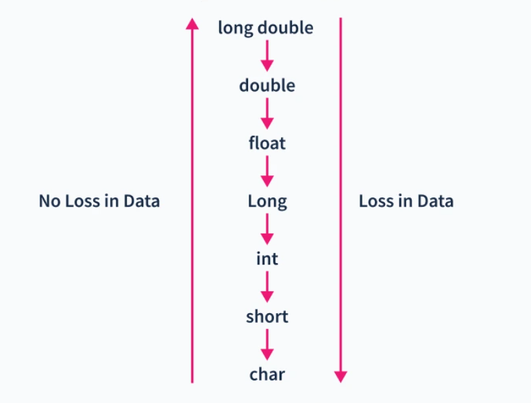

# Упражнение № 2
# Преобразуване. Побитови оператори. Условни оператори.

## Преобразуване на типове
### Явно - преобразуването се извършва с допълнително указание (от нас)
1. чрез оператор за присвояване:
2. чрез кастване:
```cpp
(тип)<израз>;
```
```cpp
<тип>(израз);
```
- Статично кастване - извършва се по време на компилация. Трябва сами да се уверим, че преобразуването, което сме избрали е валидно.
```cpp
static_cast <тип> (израз);
```
- Динамично кастване - кастване по време на изпълнение. (Ще се разгледа по-нататък).
```cpp
dynamic_cast <тип> (израз);
```

1. Неявно - преобразуването се извършва автоматично от компилатора.

При преобразуването можем да имаме загуба на информация. Това се случва, ако извършваме преобразуване от по-голям към по-малък тип.



## Побитови оператори

Побитови операции се извършват върху битовата репрезентация на целочислени типове:
- **&**	Побитово И
- **|**	Побитово ИЛИ
- **^**	Побитово ИЗКЛЮЧВАЩО ИЛИ (XOR)
- **~**	Допълнение
- **<<** Ляв шифт (като умножение на число по две)
- **>>** Десен шифт (като делене на число по две) - шифтва всички битове надясно и запълва празните позиции с бита със стойността на старшата позиция.

* За любопитните: имаме два типа шифт - аритметичен и логически

## Условни оператори

### if-else

```cpp
if (<булев израз>) {
    <тяло> // Изпълнява се когато <булев израз> е истина.
} //  В противен случай не се извършват действия.
```
```cpp
if (<булев израз>) {
    <тяло> // Изпълнява се когато <булев израз> е истина.
} else {
    <тяло> // Изпълнява се когато <булев израз> е лъжа.
} // Друг случай за <булев израз> няма.
```
```cpp
if (<булев израз 1>) {
    <тяло> // Изпълнява се когато <булев израз 1> е истина, независимо от стойността на <булев израз 2>.
} else if (<булев израз 2>) {
    <тяло> // Изпълнява се когато <булев израз 2> е истина. До условието ще достигнем само, ако <булев израз 1> има оценка лъжа.
} else {
    <тяло> // Изпълнява се когато <булев израз 1> и <булев израз 2> са лъжа.
}
```

Условните оператори **if**, **else-if**, **else** могат да се срещат в различни конфигурации.

Булевите изрази са правила за извличане на булева стойност.

### Тернарен оператор

- Триместна (тернарна) операция:
<булев_израз> ? <израз1> : <израз2>

Пресмята се <булев_израз>
- При true се пресмята <израз1> и се връща резултатът
- При false се пресмята <израз2> и се връща резултатът

### Switch

```cpp
switch (<израз>) {
    { case <константен_израз> : { <оператор> } }
    [ default : { <оператор> } ]
}
// пример:
switch (x) {
    case 1 : std::cout << "Saturday"; break;
    case 2 : std::cout << "Sunday"; break;
    default : std::cout << "Weekday";
}
```

## Задачи

1. Да се въведат две цели числа и да се разменят техните стойности по три начина (без да се ползва swap()).
    - чрез помощна променлива
    - чрез аритметични операции
    - чрез побитови операции
2. Да се напише програма, която приема цяло число и извежда дали е точна степен на двойката.
3. Какъв е резултатът от изпълнението на ляв шифт (<<) върху число x?
4. Да се определи какво ще изведе програмата:
```cpp
    int a = 10;
    int b = 010;
    int c = 0x10;

    std::cout << a << ' ' << b << ' ' << c;
```
5. Напишете програма, която да ви изписва true, ако годината е високосна, и false в противен случай.
6. Да се напише програма, която при подадено число от 1 до 7 изписва деня от седмицата, съответстващ на числото.
7. Да се напише програма, която въвежда размерите на геометрична фигура и пресмята лицето й. Фигурите са четири вида: квадрат (s), правоъгълник (r), кръг (c) и триъгълник (triangle). На първия ред на входа се чете вида на фигурата (square, rectangle, circle или triangle). Ако фигурата е квадрат, на следващия ред се чете едно число – дължина на страната му. Ако фигурата е правоъгълник, на следващите два реда четат две числа – дължините на страните му. Ако фигурата е кръг, на следващия ред чете едно число – радиусът на кръга. Ако фигурата е триъгълник, на следващите два реда четат две числа – дължината на страната му и дължината на височината към нея. Резултатът да се закръгли до 3 цифри след десетичната точка.

## Допълнителни задачи за упражнение
8. Да се прочете от стандартния вход реално число. Да се изведе цялата му част.
9. При вход положително цяло число n, да се изведе на конзолата колко секунди има в n дни.
    Примерен вход: 1
    Примерен изход:86400
10. Да се напише програма, която приема две цели числа и извежда тяхното средно аритметично.
11. Да се напише програма, която прочита 3 цели числа от стандартния вход (a, b, c) и за тях извежда дали е изпълнено:
    - a^2 + b^2 = c^2
    - Дали сумата от последните цифти на числата a и b е равна на c.
12. По вход малка латиснка буква, главната латинска буква, която й съответства.
13. Да се напише програма, която приема цяло трицифрено число и извежда цифрите му в обратен ред.
14. Да се провери дали при въведени 3 числа, тези 3 числа лежат на една права.
15.  Да се напише програма, която при подадена двумерна точка (x, y) под формата на двете и координати x и y да изписва в кой квадрант се намира точката
16.  Да се състави прогама, която въвежда три числа и ги изкарва в нарастващ ред.
17.  Да се напише програма, която при подадено целочислено число изписва името на месеца, съответстващ на това число. В случай, че числото не е валиден месец, да  "Invalid month"
18.  Да се напише програма, която при въведен символ от клавиатурата изписва
    • "lowercase letter" - ако е малка латинска буква
    • "uppercase letter" - ако е голяма латинска буква
    • "digit" - ако е цифра
    • "other" - иначе
19.  Да се напише програма, която при въведени от клавиатурата 3 оценки извежда средната оценка заедно с оценката в текстов формат в зависимост от това в кой интервал попада.
    • [2, 3) - Poor
    • [3, 3.5) - Average
    • [3.5, 4.5) - Good
    • [4.5, 5.5) - Very Good
    • [5.5, 6] - Excellent
20.  Преди да компилирате следния код, проследете изпълнението му и предположете какво ще изпише и защо.
```cpp
#include<iostream>
using namespace std;
int main() {
    int a = 31;
    int b = a++;
    cout << b << endl;
    cout << ++a << endl;
    a = b / 10;
    cout << a-- << endl;
    if(b == 31) {
        b = ++a;
    } else {
        b = a--;
    }
    cout << a << endl;
    cout << b << endl;
    return 0;
}
```
21. Да се напише програма, която при подадени радиус r и двумерна точка (х, у) проверява дали точката се намира вътре/извън или по контура на окръжност с център (0,0).
22. 1.  Да се състави програма, която въвежда от клавиатурата цяло положително петцифрено число.
Програмата да изведа:
    а) броя на нечетните цифри на числото;
    б) сумата на четните цифри на числото.
23. 💡 Да се напише програма, която при въведана сума да изписва броя монети, нужни за получаване на сумата, ако  предположим, че разполагаме с безброй много монети от 100, 50, 20, 10, 5, 2, 1 и първо взимаме колкото можем от най-голямата възможна монета.
24. 💡 По въведена дата (ден, месец, година) да се изведе следващата.
25. 💡 Дадени са ви 9 числа (матрица 3x3). Да се провери дали е магически квадрат. Един квадрат наричаме магически ако сумата от стойностите по редовете, сумата по колоните и сумата на главният и второстепенният диагонал е една и съща.
