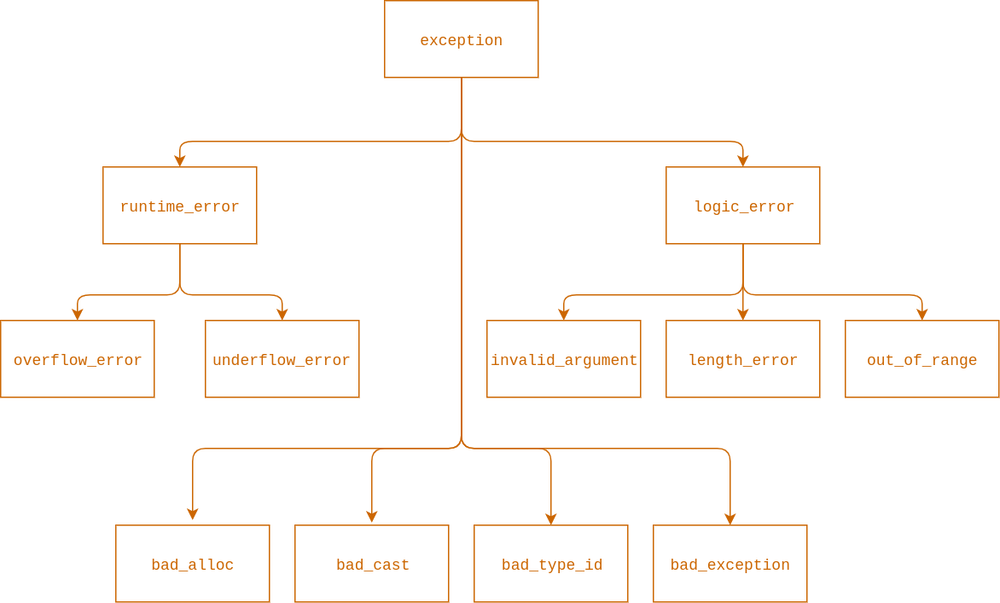
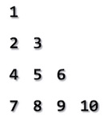

# Упражнение № 3
# Оператори за цикъл. Оператори break, return, continue. Assert. Error handling.

## Оператори за цикъл

Когато искаме поредица от инструкции да се изпълни повече от веднъж можем да поставим тези инструкции в тялото на т.нар. цикъл.

### Цикъл [for](https://en.cppreference.com/w/cpp/language/for)
```cpp
for ( <инициализация> ; <условие> ; <израз/обновяване> )
    <тяло>
```

Елементи:
   - Инициализация - дава възможност за дефиниране променливи като управляващи за цикъла
   - Условие - булев израз, който ако се оцени до истина се изпълненява тялото на цикъла. Оценяването на условието се случва на всяка итерация
   - Обновяване - обновяване на стойностите на управляващите за цикъла променливи или на други

Допълнителни бележки:
   - В инициализацията могат да се дефинират една или повече промеливи. Тези променливи имат област на видимост до края на блока на for-цикъла
   - Управляващите променливи за цикъла могат да бъдат декларирани и преди цикъла. Тогава те ще бъдат видими и след него
   - Ако няма нужда от управляващи променливи, то инициализационната стъпка може да е празна

Пример за безкраен for-цикъл:
```cpp
for (;;) {
    // ...
}
```

⚠️ Безкрайните цикли са лоша практика!

### Цикъл [while](https://en.cppreference.com/w/cpp/language/while)
```cpp
while ( <условие> )
    <тяло>
```

- Цикълът while изпълнява тялото си **докато** условието му не стане лъжа
- Циклите for и while са взаимно заменяеми
- Обикновено използваме while когато не знаем колко пъти искаме да се изпълни тялото на цикъла или ако нямаме явна управляваща променлива за цикъла

Пример за безкраен while-цикъл:
```cpp
while (true) {
    // ...
}
```

⚠️ Безкрайните цикли са лош индикатор. С тях трябва да работим с повишено внимание.

### Цикъл [do-while](https://en.cppreference.com/w/cpp/language/do)
```cpp
do
    <тяло>
while ( <условие> );
```

- do-while е цикъл с пост-условие
- Тялото му ще се изпълни поне веднъж
- Могат да доведат до грешки, трябва да се внимава

### Цикъл [for-each](https://en.cppreference.com/w/cpp/language/range-for)
```cpp
for ( <инициализация> : <израз> )
    <тяло>
```

Пример:
```cpp
for (char letter : myName) { // За всяка буква от името ми (За всеки елемент от ...)
    std::cout << letter; // Принтирай буквата (Действия)
}
```

- Елементите се обхождат от първи към последен
- Областта на видимост на управляващите променливи е тялото на цикъла

### Оператори break, continue, return

- Цикъл спира да се изпълнява когато условието му стане лъжа.
- Ако условие няма, цикълът няма да терминира освен ако в тялото му няма оператори, които да предизвикат терминацията му

#### 1. [break](https://en.cppreference.com/w/cpp/language/break)
- Прекратява изпълнението на **най-вътрешния** цикъл
- Може да бъде като част от тялото на условие
```cpp
for ( ... ) {
    if ( <условие> ) {
        break;
    }
}
```

- Наличието на break прави програмата по-трудна за верифициране

#### 2. [continue](https://en.cppreference.com/w/cpp/language/continue)
- Операторът пропуска изпълнението на останалата част от тялото на цикъла и минава директно към стъпката обновяване, ако има такава, или проверка на условието.

Пример:
```cpp
int i = 0;
for (int i = 0; sum < 100; ++i) {
    if (i % 2 == 0) {
        continue;
    }
    sum += i;
}
```

#### 3. [return](https://en.cppreference.com/w/cpp/language/return)
- Излиза от текущата **функция**
- Може да връща резултат при изхода или да не връща нищо (при тип на връщане void)

## [Assert](https://en.cppreference.com/w/cpp/error/assert)

- За да използваме assert трябва да добавим библиотеката [cassert](https://cplusplus.com/reference/cassert/).
```cpp
#include <cassert>
```

- assert е макро функция, която може да се ползва за дебъгване
- Ако assert клаузата е лъжа, се извежда съобщение за грешка

❓Какво са макроси (допълнителна тема)

## Error Handling - throw, try, catch

- Изключения се предизвикват от невалидни състояния, до които програмата може да достигне в хода на нейното изпълнение
- Механизъм за улавяне на грешки (*изключителни* събития) и дефиниране на поведение за справяне с тях.
- Предимство на С++ над С

Елементи:

**throw**:
- Хвърля изключение когато бъде засечен проблем
- Може да бъде хвърлян всякакъв тип, но рядко се ползват примитивните типове за тази цел
- Изключението трябва да дава информация за възникналия проблем

**try**:
- Дефинира блок от код, който може да предизвика изключение

**catch**:
- Дефинира блок, който да се изпълни когато определено изключение е било хванато (клауза, която служи за прихващането на изключение от даден тип)
- Можем да имаме:

| Съдържание на `catch`-клаузата | Обяснение |
| --- | --- |
| `(...)` | Всички изключения. |
| `std::exception` | Най-общия клас изключения. Всички останали стандартни изключения произлизат от него. |
| `std::logic_error` | Логическа грешка. |
| `std::invalid_argument` | Подаден невалиден аргумент на функция. |
| `std::out_of_range` | Индекс е извън обхавата на структура данни. |
| `std::runtime_error` | Грешка, която не можем да засечем четейки кода. |
| `std::overflow_error` | Препълване (например, ако резултатът от изчисление е твърде голям за типа, на който искаме да го присвоим). |

Пълен списък с изключенията можете да намерите [тук](https://www.tutorialspoint.com/cplusplus/cpp_exceptions_handling.htm)

## Йерархия
&nbsp;


## Пример

```cpp
#include <iostream>
#include <stdexcept>

double trianglePerimeter(double a, double b, double c) {

    if (a <= 0 || b <= 0 || c <= 0) {
        throw std::invalid_argument("There are nonpositive sides of the triangle.");
    }

    return a + b + c;
}

int main() {
    int a = 3, b = 4, c = 2;
    int perimeter = 0;

    try {
        perimeter = trianglePerimeter(a, b, c);
        std::cout << "The perimeter is: " << perimeter << '\n';
    } catch (std::invalid_argument &exception) {
        std::cout << exception.what() << '\n';
    }

    return 0;
}
```

## Задачи
1. Даден е цикъл for. Да се напише еквивалентен на него цикъл while.
```cpp
for (int i = 0; i < myNameLength; ++i) {
    std::cout << myName[i];
}
```

2. Да се напише програма, която чете цели положителни числа от конзолата докато не се въведе -1.
Тогава oт въведените числа да се изведат следните:
    - най-голямото четно число;
    - най-голямото нечетно число;
    - сборът на всички числа;
    - средноаритметичното на всички числа.

3. Да се напише програма, която приема две цели числа и извежда като редица всички цели числа между тях. Ако първото число е по-голямо, да се изведе намаляваща редица. Редовете да бъдат с дължина най-много 10 числа.

4. Напишете програма, която прочита цяло положително число n и отпечатва всички прости числа по-малки или равни на n.

5. Да се напише програма, която приема цяло число n и извежда n-тото число на Фибоначи. Числата на Фибоначи са:
    - fib(0) = 0
    - fib(1) = 1
    - fib(n) = fib(n - 1) + fib(n - 2), n > 1

6. Да се приеме цяло число k и да се изведе триъгълник от k реда във вида на Floyd's triangle



## Допълнителни задачи
7. Да се напише програма, която приема цяло положително число и извежда цифрите му наобратно.

8. Да се напише програма, която приема цяло число и връща дали в него има повтарящи се цифри.

9.  Да се напише програма, която приема цяло число n и след това n на брой цели числа.
Да се изпише yes, ако съществуват равни последователно въведени числа и no в противен случай.

10.  (*) Да се напише програма, която приема цяло число n и след това n на брой цели числа.
Да се изпише yes, ако съществуват точно две равни последователно въведени числа и no в противен случай.

11.  (*) Да се напише програма, която приема цяло число n и след това n на брой цели числа.
а) Ако има повтарящи се последователни стойности, да се изведе дължината на най-дългата такава редица.
б) Да се изведе и самото число

12.  Дадено ви е положително цяло число n. Разглеждайки числото в двоична бройна система, изведете:
    - Броят битове със стойност 1 в числото
    - Броят битове със стойност 0 в числото
    - Дали числото е точна степен на двойката
    - Дали числото е съставено от алтерниращи битове (т.е. всеки два съседни бита имат различни стойности)
    - Числото, получено от обръщането на всички нули в единици и обратно
Пример: 4
Number of ones: 1
Number of zeros: 2
Is a power of 2: yes
Has alternating bits: no
Complement: 3

13.  (*) Да се напише програма, която при подадено цяло число изписва всички негови прости делители.

14.  Да се напише програма, която по подадено неотрицателно число пресмята за колко стъпки
    може да се превърне в 0. Правилата са следните:
    - Ако числото е четно, го делим на 2.
    - Ако числото е нечетно, изваждаме 1 от него.

15.  Да се напише програма, която приема естествено число n и n на брой числа. Като резултат да се изведе сумата от квадратите на всички числа.

16.  Да се напише програма, която приема естествено число n и извежда разликата:
   (1 + 2 + ... + n)^2 - (1^2 + 2^2 + ... + n^2)

17.  Да се напише програма, която по въведено число проверява дали може да се получи като сума на две прости числа и извежда всички варианти на конзолата.

18.  Дадено е цяло неотрицателно число и възможността да се разменят само две от цифрите му. Да се намери най-голямото число, което може да се образува.

19.  Да се напише програма, която приема число и обръща знака му чрез побитови операции.

Пример:
- 4753 -> 7453
- 7266 -> 7662
- 854 -> 854

## Допълнителни материали

📑 https://www.codecademy.com/learn/learn-about-the-basics-of-programming-with-codecademy?fbclid=IwAR1us8gXlC5gqfBNknm1JxLnzEUDKAXXUt8UVFx9C8ZdhPWxaA26dgX0XCI

📑 https://www.codecademy.com/learn/learn-to-code-with-blockly?fbclid=IwAR2m13B2Zl1vXyKPGDKB6V5IhstH6y6oURNPeKirdjC-UazdpOGs1xR8RdI

## GitHub Classroom

📑 https://classroom.github.com/a/PztOfnpW
