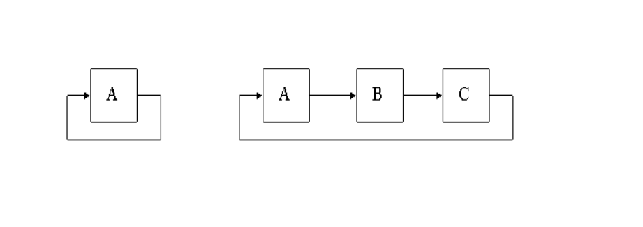

# Упражнение №11. Рекурсия

### Основи
- Рекурсивна функция е всяка функция, която прави обръщане към себе си (вика себе си) директно или индиректно
- Ако при дефиниране на едно понятие се използва самото понятие
- За да разберете какво е рекурсия, първо трябва да разберете какво е рекурсия


### Вече сме виждали рекурсия
```cpp
int factorial(int n) {
    if (n > 1) {
        return factorial(n - 1) * n;
    }

    return 1;
}

int fibonacci(unsigned int n) {
    if (n == 0) {
        return 0;
    }

    if (n == 1) {
        return 1;
    }

    return fibonacci(n - 1) + fibonacci(n - 2);
}
```

### Предназначение
- Рекурсия може да се приложи за решаване на проблеми, които могат да бъдат разделени на по-малки, повтарящи се проблеми
- Ако задача се състои от подзадачи със същата структура
- Рекурсията често е по-кратка и позволява писането на по-лесни за четене програми

```cpp
int sumRange(int num) {
    if (num == 0) {
         return 0;
    }

    return num + sumRange(num - 1)
}
```

### Строеж
За да се дефинира валидна рекурсивна функция трябва да има:
- Дъно на рекурсията - базови случаи, в които дадената задача може да бъде решена чрез "брутална сила" (можем да дадем отовор с "брутална сила")
- Дефиниране на решение на останалите случаи чрез пряка зависимост от техните подзадачи

⚠️ Ако дъното бъде пропуснато, може да се стигне до зацикляне на програмата и StackOverflowException

```cpp
// Run at your own risk ;)
void stackoverflow(int random) {
    stackoverflow(random – 1);
}

int main() {
    stackoverflow(INT_MAX);
}
```

### Класификация

- **Пряка** - в тялото на функция се извършва обръщане към (викане) същата функция
    - Опашкова рекурсия - ако рекурсивното извикване е последната команда/израз.
```cpp
void tailRecursive(int n) {
    if (n > 0) {
        // Some operations
        tailRecursive(n - 1);
    }
}
```

- **Косвена** - функция F1 прави обръщане към F2, която прави обръщане към F3, ..., която прави обръщане към F1



Спрямо броя обръщения на функция към себе си, рекурсията бива:
- **Линейна** - прави едно извикване към себе си (пример за такава функция е факториел)

- **Нелинейна** - прави повече от едно извиквания към себе си (пример за такава функция е фибоначи)

### Итеративен vs Рекурсивен подход

| Итерация | Рекурсия |
| --- | --- |
| Няма нужда от създаване на отделна функция | Рамка в стековата памет се алокира при всяко едно извикване на функцията. <br> Получава се "верига" от много стекови рамки, до достигне дъното на рекурсията |
| При итерация чрез цикъл не се създава нова рамка и не се заема непрекъснато още памет | Много тежка откъм памет |
| Изискват повишено внимание, за да не се стигне до безкраен цикъл | **StackOverFlow** - при изчерпване на стековата памет, в която да се заделят нови рамки |

⚠️ Предпочитайте итеративният подход пред рекурсия когато е възможно <br>
⚠️ Ползването на рекурсия е опасно, тъй като струва скъпо откъм памет

## Задачи

**Задача 1** Да се напише функция, която намера сумата на числата от 0 до n

#

**Задача 2** Да се напише функция, която повдига число на степен n

#

**Задача 3** Да се напише функция, която намира сумата от цифрите на положително цяло число

#

**Задача 4** Да се напише функция, която намира произведението на цифрите на положително цяло число

#

**Задача 5** Да се напише функция, която проверява дали в цяло положително число n съдържа цифра k

#

**Задача 6** Да се напише функция, която намира броя на цифрите на положително цяло число

#

**Задача 7** Да се напише функция, която извежда цяло положително число в обратен ред

#

**Задача 8** Да се напише функция, която обръща цяло положително число
