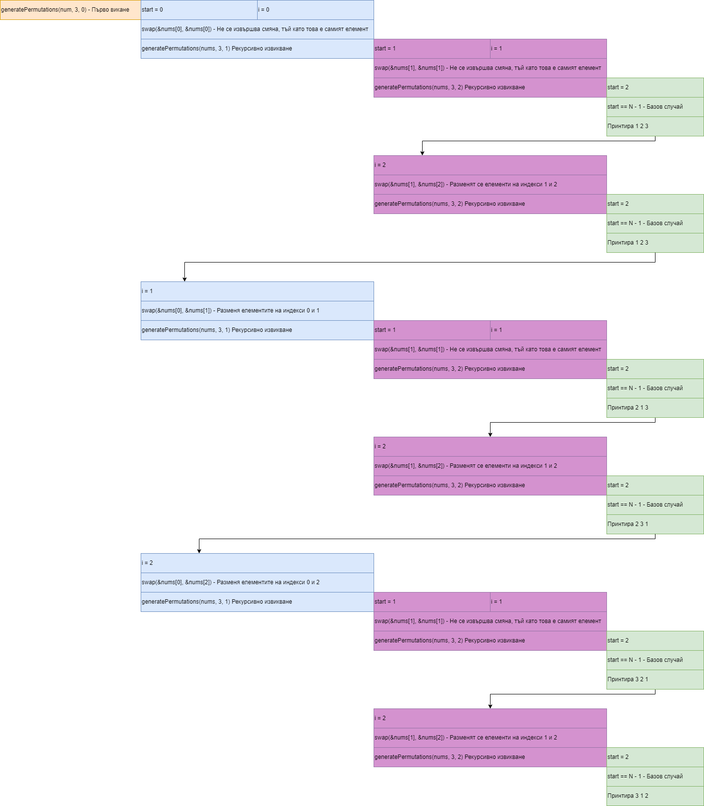

# Упражнение №12. Рекурсия. Backtracking.

Рекурсия - Метод за решеване на задачи, при които намирането на решение зависи от намирането на решения на "по-малки" примери от същата задача.

Backtracking - Подход за решаване на задачи, при който се изграждат кандидат-решения до изчерпване на вариантите или намиране на решение.

Backtracking - Винаги използва рекурсия.

### Задачи върху масиви

**Задача 1** Да се напише функция, която проверява дали елементът x принадлежи на редицата а_0, а_1, …, а_{n-1}

#

**Задача 2** Да се напише функция, която проверява дали редицата а_0, а_1, …, а_{n-1} е монотонно растяща.

#

**Задача 3** Да се напише функция, която проверява дали елементът x принадлежи на сортирана редицата а_0, а_1, …, а_{n-1}

#

**Задача 4** ✍️ Да се дефинира функция, която приема низ A и низ B и проверява дали низ B се съдържа в низ А.

#

**Задача 5** ✍️ Да се дефинира рекурсивна функция void printBackwards(const char* begin, const char* end).

Параметрите begin и end са указатели към елементи на буфер от символи, като end ≥ begin. Символен низ с начало begin и край end наричаме последователността от символи, започваща със символа, намиращ се на адрес begin и завършваща със символа на адрес end - 1, включително, дори и ако някой от тези символи е с код 0.

Функцията print_backwards да извежда на стандартния изход всички думи в низа с начало begin и край end в ред, обратен на срещането им в низа, и разделени с точно един интервал.

Вход:
I need a break!

Изход:
break! a need I

# Backtracking

## Върху масив

**Задача 6** Да се генерират всички възможни пермутации от числа в интервала от 1 до N.
- N = 3
- Пермутации: 1 2 3, 1 3 2, 2 1 3, 2 3 1, 3 1 2, 3 2 1

#

**Задача 7** Да напишете функция, която генерира всички възможни комбинации от числа в интервала от 1 до N, чиито елементи имат сума K.  
- N = 5, K = 5
- Комбинации: 1 1 1 1 1, 1 1 1 2, 1 1 3, 1 2 2, 2 3, 1 4, 5.

#

**Задача 8** Даден е лабиринт, представен като двумерен масив от символи.  
Символите могат да бъдат два вида:
- ' ' - празно поле, на което може да се стъпи
- '*' - стена, препятствие

Да се напише програма, която намира дали има път в лабиринт от горния ляв ъгъл до долния десен ъгъл.  
Позволени движения: надясно, надолу, наляво или нагоре. 

{' ', '*', ' ', ' ', ' '}, 
{' ', '*', '*', '*', ' '}, 
{' ', ' ', ' ', ' ', ' '}, 
{' ', '*', '*', '*', ' '}, 
{' ', ' ', ' ', ' ', ' '} 

#

**Задача 9** Даден е двумерен масив (матрица) от символи, представляващи игрално поле. 
Символите могат да бъдат:
- 'X' - препятствие
- 'O' - свободна клетка
- '.' - цел, която трябва да бъде достигната
Началната точка е горния ляв ъгъл на матрицата.  

Да се напише функция, която намира всички възможни пътища от началната точка до всяка от целите ('.') в матрицата, като можете да се движите само надясно и надолу, и не можете да минавате през 'X' (препятствия).  

Да се изведете списък с всички пътища, които водят до целите в матрицата, описвайки направените движения (D - down, R - right).  

{'O', 'X', 'O', '.'},  
{'O', 'O', 'X', 'O'},  
{'X', 'O', 'O', 'O'},  
{'O', 'X', '.', 'O'}  
