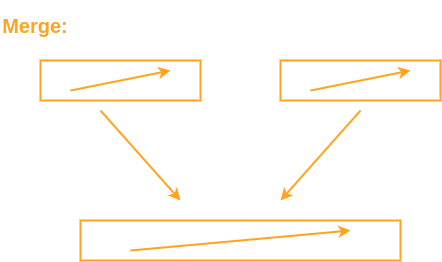
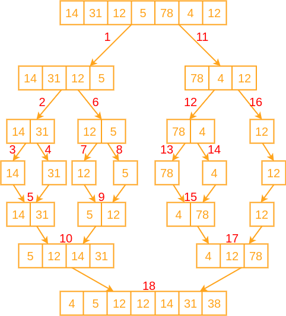

# Преговор част 2. Задачи.

## Преговор част 2

[Преговор част 2](https://docs.google.com/document/d/1vRcyT04POVxuTD3bEA4yDVYSmnKBbI5zOM-uHaGGp5M/edit#heading=h.5k9bdqdkl3uw)

[Quiz](https://docs.google.com/document/d/1d5rw6paD42Lt0_L2KayOwd_QdWJgd4GWauCj6GXDtQ0/edit#heading=h.hlzmk0n5p5dd)

## Merge sort

Алгоритъмът се базира на подхода **разделяй и владей**. \
Идея: Разделя масива на две равни части и обединява двата сортирани подмасива. \
База: Масив с един елемент е винаги сортиран.

Merge обединява двата вече сортирани масива в един общ.

Визуализация на merge sort по стъпки.

Ползва допълнителна памет. \
Сложността на рекурсивните алгоритми се определя като се сметне тяхното рекуренто уравнение. \
Рекурентно уравнение на Merge Sort:
T(n) = 2*T(n/2) + O(n)

## Задачи

**Задача 1** 
Дадени са 3 сортирани масива. 
Да се намерят общите им елементи.

#

[**Задача 2**](https://www.geeksforgeeks.org/maximum-sum-path-across-two-arrays/)  
Дадени са два сортирани масива.  
На всеки индекс в кой и да е масив може да се прави 'скок' към същия елемент (със същата стойност, но не задължително на същия индекс) в другия масив. 
Стъпка в масив е придвижване с един индекс напред.  
Да се намери максималната сума на обходени елементи от началото на единия масив до края на един от двата масива.

#

**Задача 3** 
Даден е масив от цели числа. Всяко число число представлява височина на колона.  
Между всеки две колони може да бъде налята вода, толкова литри колкото е abs(height(col1) - height(col2)). 
Да се намери колко най-много вода може да бъде налята над колоните.

## Подготовка за изпит

[Поправителен изпит 2020/2021](https://docs.google.com/document/d/1-DT6CWbD9h_GsNNuLvKohhz9WTKZrndAYJE3QrGa9oU/edit)

[Устен изпит 2019](https://learn.fmi.uni-sofia.bg/pluginfile.php/237811/mod_resource/content/0/Usten%20izpit_UP_26_01_2019%20%281%29.pdf)

[Допълнителни въпроси](https://docs.google.com/document/d/1dvAye6-bbQUOQ_zwcOxDZWa3FaGomWMW3IT8c-TyFNQ/edit)
